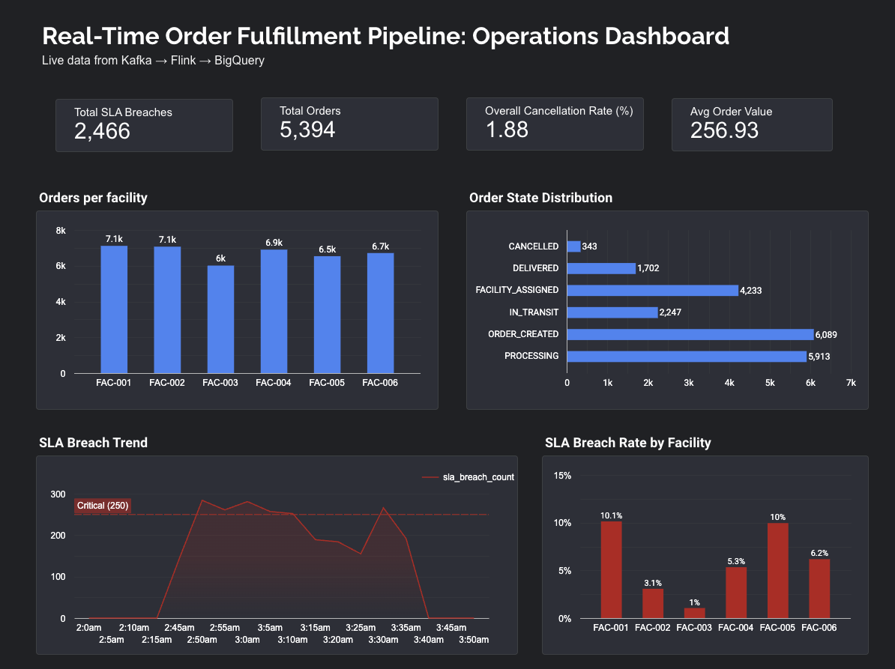
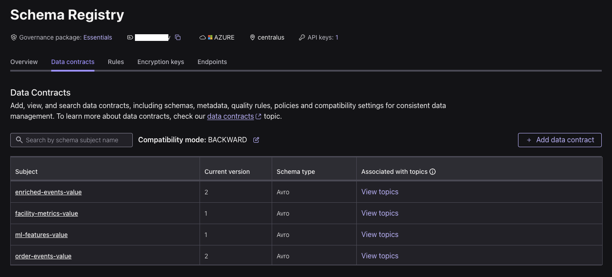
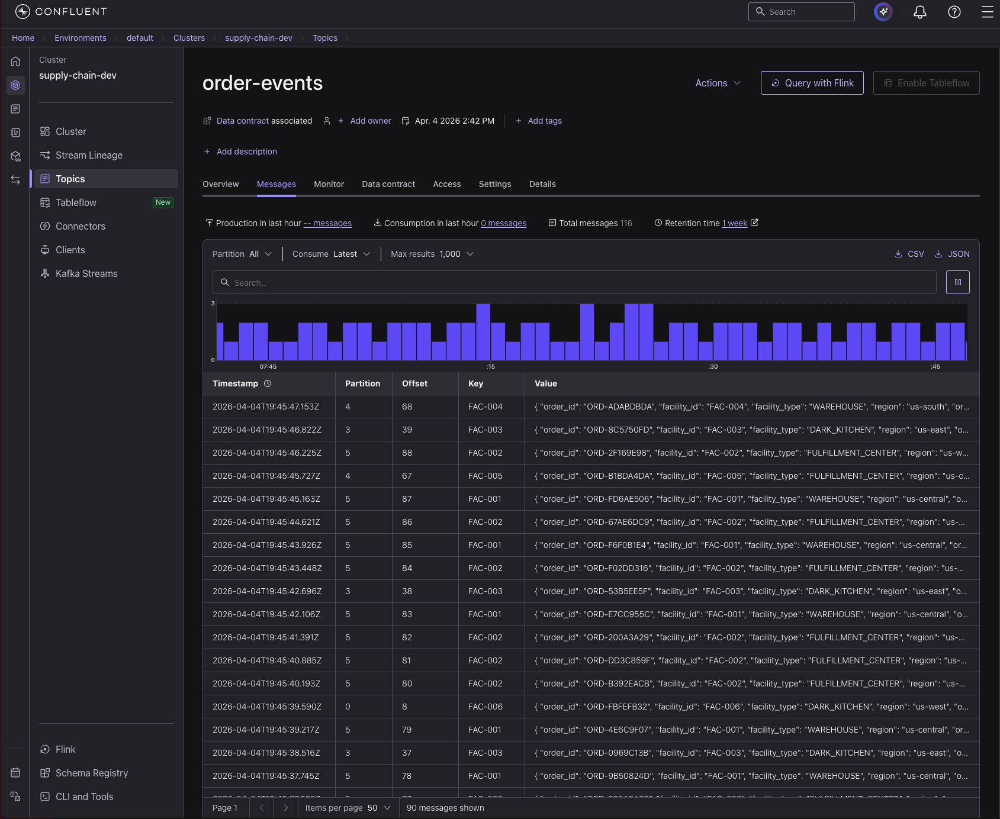
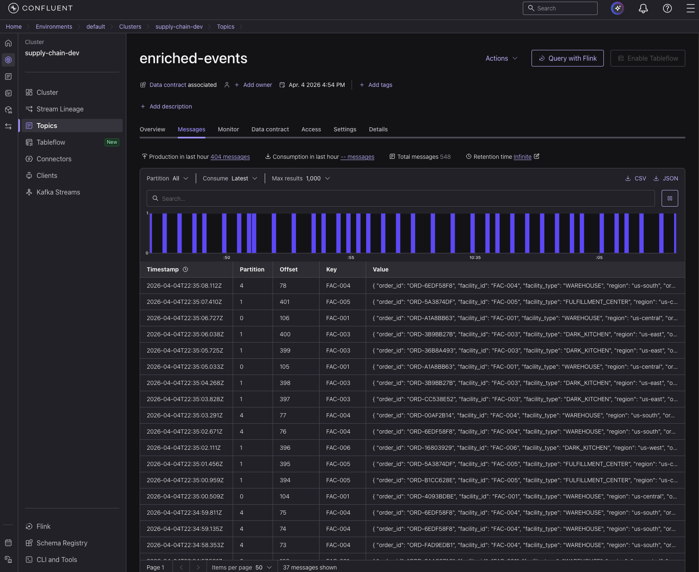
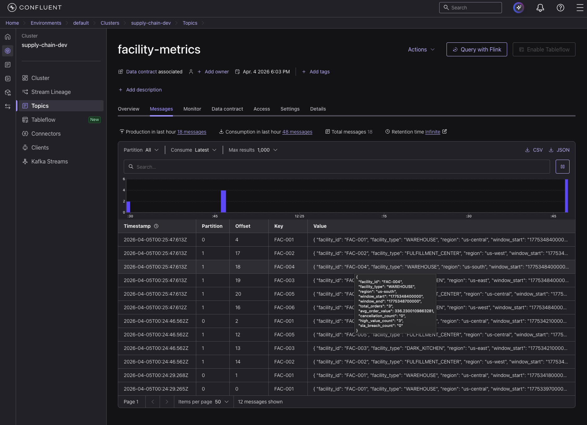
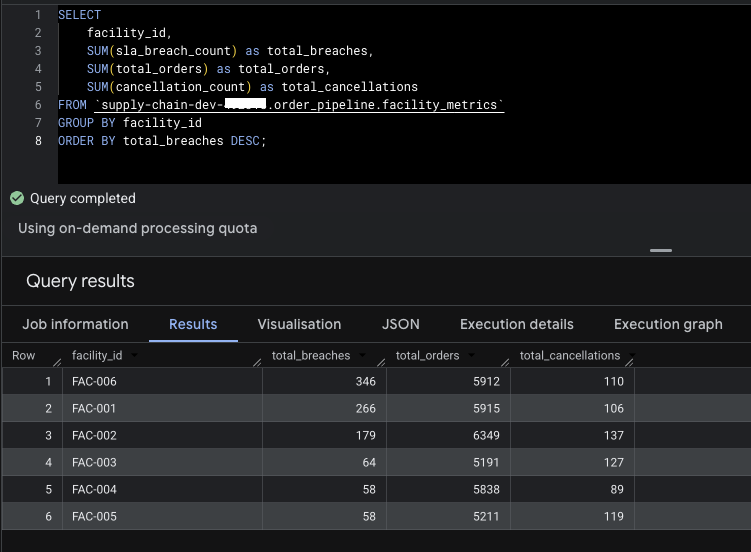
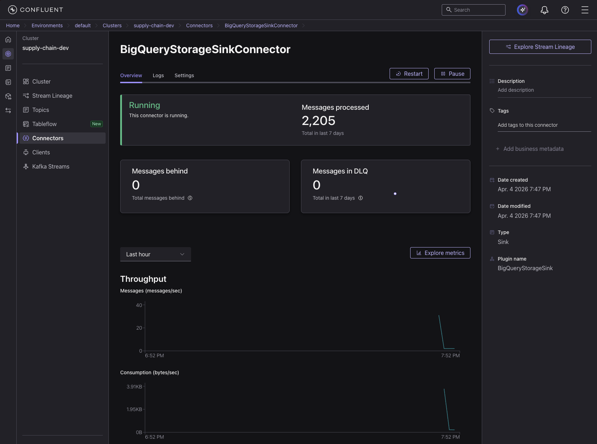

# kafka-flink-order-pipeline
 
Real-time order fulfillment pipeline built on Confluent Cloud. It processes order lifecycle events across fulfillment facilities, detects SLA breaches, computes windowed metrics per facility, and generates ML-ready features. All in real time.
 
The same pipeline applies to supply chain (warehouse/fulfillment), food delivery (dark kitchen/restaurant), and logistics (3PL/last-mile). Same events, same Flink jobs, but different framing depending on domain.
 
---
 
## Architecture
 


---
 
## Dashboard
 

 
Live operations dashboard showing facility throughput, SLA breach trends, order state distribution, and avg order value. Powered by data flowing from Kafka through Flink into BigQuery.
 
---
 
## Tech Stack
 
| Layer | Tool | Version | Why |
|---|---|---|---|
| Event streaming | Confluent Cloud Kafka | Latest | Managed Kafka, same as Uber and DoorDash run in production |
| Schema management | Confluent Schema Registry | Latest | Avro contract between producer and consumers |
| Stream processing | Confluent Flink SQL (managed) | Latest | Standard for real-time processing in 2026 |
| Sink connector | Kafka Connect BigQuery Sink V2 | Latest | No custom consumer code needed for simple append sinks |
| Analytical store | Google BigQuery | Latest | Schema auto-created from Avro, easy Looker Studio integration |
| Dashboard | Looker Studio | Latest | Free, native BigQuery connection |
| Producer | Python + Faker | confluent-kafka 2.13.2 | Stateful order lifecycle simulation |
 
---
 
## Engineering Decisions
 
**Partitioned by `facility_id` not `order_id`**
 
Downstream Flink jobs aggregate at the facility level. Partitioning by `facility_id` puts all events for a facility on the same partition, so ordering is preserved without cross-partition shuffles. Partitioning by `order_id` would require Flink to reshuffle data for every facility-level aggregation anyway.
 
**Event-time processing with watermarks**
 
Windows are based on when events actually happened (`$rowtime`) not when Flink processed them. A late-arriving event should not change a metric that was already emitted for a closed window. The 30-second watermark gives a buffer for out-of-order events before closing each window.
 
**Tumbling windows for metrics, sliding windows for ML features**
 
`facility-metrics` uses 5-minute tumbling windows. Operations teams want discrete period snapshots to compare performance across intervals. `ml-features` uses 15-minute sliding windows with a 5-minute slide. ML models need continuously updated signals, and a value that resets every 5 minutes is not useful for a model scoring in between resets.
 
**Avro over JSON**
 
JSON has no schema enforcement. Nothing stops a producer from sending an integer where a string is expected and silently breaking every downstream consumer. Avro with Schema Registry enforces types at registration time. A bad schema change gets rejected before a single broken message reaches Kafka.
 
**Kafka Connect over a custom consumer for the sink**
 
A custom consumer for BigQuery would need its own deployment pipeline, offset management, and restart logic. The managed Kafka Connect connector handles all of that and creates BigQuery tables automatically from the Avro schema. For a simple append sink this is the right trade-off.
 
**Fate-based order simulation**
 
Each order gets an outcome assigned at creation (complete, cancel, or SLA breach) not at each state transition randomly. In reality an order's outcome depends on factors present at creation time: inventory availability, courier pool, customer history. Random per-step decisions produce unrealistic event patterns.
 
---
 
## Flink Jobs
 
### Job 1: Stream Enrichment
 
**Source:** `order-events` **Sink:** `enriched-events`
 
Sits between raw ingestion and the aggregation jobs. Drops events with nulls on critical fields so bad data does not reach downstream. Adds three derived fields: `is_high_value` (order over $200), `is_terminal` (DELIVERED or CANCELLED), and `processing_time` (wall clock time for latency tracking).
 
Keeping data quality logic separate from aggregation logic makes both easier to debug and change independently.
 
### Job 2: Windowed SLA Breach Detection + Metrics
 
**Source:** `enriched-events` **Sink:** `facility-metrics`
 
Computes per-facility metrics in 5-minute tumbling windows. SLA breaches are identified by `previous_state = 'PROCESSING'` on a PROCESSING event, which means the order was already stuck in PROCESSING on the previous event rather than just arriving from FACILITY_ASSIGNED. Each window emits total orders, avg order value, cancellation count, high-value count, and SLA breach count.
 
### Job 3: ML Feature Generation
 
**Source:** `enriched-events` **Sink:** `ml-features`
 
Generates rolling features per facility using 15-minute sliding windows with a 5-minute slide. Every 5 minutes, each facility gets a fresh feature row covering the last 15 minutes: rolling order volume, cancellation rate, avg order value, and a binary SLA breach flag. These are the inputs a delivery time prediction model or anomaly detector would consume.
 
---
 
## Schema Evolution Demo
 

 
Added `priority_tier` (enum: STANDARD/EXPRESS/PRIORITY, default STANDARD) as schema version 2 in Confluent Schema Registry. All three Flink jobs kept running without restart. The enrichment job automatically propagated the new schema to `enriched-events`. The aggregation jobs consumed the new schema without any changes to their output schemas.
 
This is BACKWARD compatibility in practice. A new field with a default value means old consumers can read new messages without knowing the field exists. No coordinated deploy across producers and consumers needed.
 
---
 
## Screenshots

### Kafka topics with live message flow



### Enriched events with derived fields



### Facility metrics with SLA breach counts



### BigQuery receiving data from Kafka Connect



### Kafka Connect BigQuery Sink connector running


 
---
 
## Producer Simulation
 
```
ORDER_CREATED -> FACILITY_ASSIGNED -> PROCESSING -> IN_TRANSIT -> DELIVERED
                                                 -> CANCELLED (only before PROCESSING)
                                                 -> stuck PROCESSING (SLA breach)
```
 
Fate distribution at order creation (changes in screenshots to have sla breach spike):
- 89.9% complete normally
- 10% cancel before PROCESSING
- 0.1% stall at PROCESSING
 
The SLA breach signal uses `previous_state`. Normal PROCESSING transitions set `previous_state = FACILITY_ASSIGNED`. Stuck orders set `previous_state = PROCESSING`. Flink filters on this distinction to count genuine breaches without counting every order that enters PROCESSING for the first time.
 
Stuck orders are tracked in a set and prioritized 70% of the time in event selection. This ensures breach events accumulate within a 5-minute Flink window. Without this, a stuck order might get picked so rarely that a full window closes before enough breach events accumulate to register.
 
---
 
## How to Run
 
### Prerequisites
- Confluent Cloud account (free trial, $400 credit)
- GCP account with BigQuery enabled (free trial, $300 credit)
- Python 3.11+, uv
 
### Setup
 
```bash
git clone https://github.com/sanjaikgv/kafka-flink-order-pipeline.git
cd kafka-flink-order-pipeline
 
# with uv (recommended)
uv sync
 
# or with pip
pip install -r requirements.txt
```
 
Create `.env` from the template:
 
```bash
cp .env.example .env
# fill in your Confluent Cloud and Schema Registry credentials
```
 
### Confluent Cloud Setup
 
1. Create a GCP cluster (us-central1)
2. Create 4 topics: `order-events` (6 partitions), `enriched-events` (6 partitions), `facility-metrics` (3 partitions), `ml-features` (3 partitions)
3. Generate a Kafka cluster API key and a Schema Registry API key
4. Run the SQL files in `flink/` in Confluent Flink SQL workspace in order: enrichment first, then facility_metrics, then ml_features
5. Add a BigQuery Sink V2 connector pointing at `enriched-events` and `facility-metrics`
 
### Run the producer
 
```bash
uv run producer.py
```
 
---
 
## What I Would Change in Production
 
The BigQuery sink uses managed Kafka Connect which works well for a simple append pattern, but it does not give you dead letter queue support out of the box. I would add a DLQ topic for failed sink messages and alert on DLQ depth.
 
The producer runs as a plain Python process. In production this would be containerized, deployed on Kubernetes with resource limits and a liveness probe tied to the Kafka delivery callback error rate.
 
The Flink jobs use `$rowtime` (Kafka arrival time) for windowing. For events from mobile or edge sources where network delay is unpredictable, I would switch to the business `event_timestamp` field with an explicit watermark sized to observed tail latency.
 
Schema compatibility is set to BACKWARD. FULL_TRANSITIVE would be stricter and safer for a team with multiple producers writing to the same topics.
 
---
 
## License
 
MIT
 